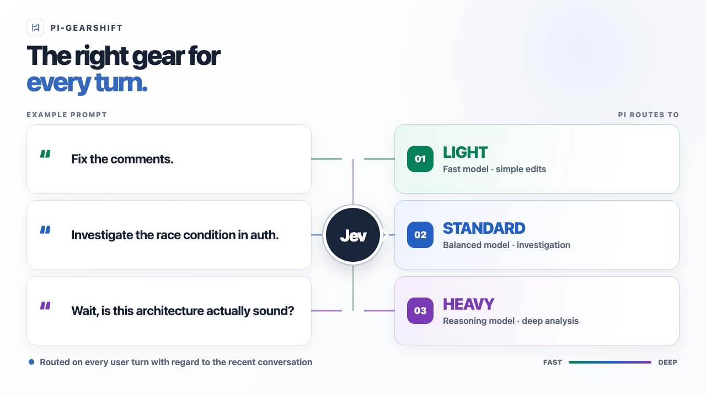

# pi-gearshift



Let [Jev](https://typesafe.ai/) choose the model and thinking level for each turn in the Pi Coding Agent.

- `light` — straightforward, low-risk work
- `standard` — typical implementation and debugging
- `heavy` — deep, ambiguous, broad, or high-risk work

## Get started

```bash
pi install npm:pi-gearshift
pi
```

The setup wizard guides you through choosing models and thinking levels for each gear. It asks for a [TypeSafe API key](https://console.typesafe.ai/) for automatic routing.

You can configure by `/gearshift settings` or editing `~/.pi/agent/pi-gearshift/settings.json` manually.

## Commands

| Command | Purpose |
| --- | --- |
| `/gearshift status` | Show current configuration and authentication status |
| `/gearshift settings` | Configure gears and routing bias |
| `/gearshift use light\|standard\|heavy` | Switch gears manually, even when automatic routing is disabled |
| `/gearshift enable` | Enable automatic routing |
| `/gearshift disable` | Disable automatic routing |
| `/gearshift login` | Save a TypeSafe API key |
| `/gearshift logout` | Remove the saved key and disable automatic routing |

You can also supply your key through `TYPESAFE_API_KEY`. Set `PI_GEARSHIFT_DATA_DIR` to change the data directory.

## How it works

Before each turn, Jev evaluates the request and Gearshift selects a model and thinking level. If routing fails, Pi continues with its current setting without retrying.

Routing sends your complete request and a limited number of recent user or assistant messages to TypeSafe. Recent messages are shortened to a limited length; thinking blocks, tool calls, and tool results are excluded.

## License

MIT
